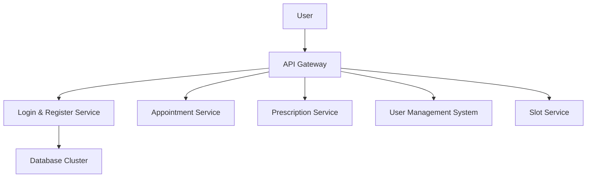

# Vaidya: Holistic Healthcare Microservices Platform

**Empowering wellness through scalable, modular Spring Boot microservices.**

---

  

## Introduction

Vaidya is a cutting-edge healthcare management system built on **Spring Boot** with a microservices architecture. Named after the Sanskrit word for "physician," Vaidya streamlines patient-doctor interactions through five independent yet interconnected services: user authentication, appointment scheduling, prescription management, user administration, and slot allocation. It’s designed for scalability, security, and ease of use, leveraging RESTful APIs to deliver a seamless healthcare experience.

---

## Architecture Overview

Vaidya’s microservices communicate via REST APIs, orchestrated through a lightweight API Gateway. Below is the high-level architecture:



## Features

  ### 1.  Login & Register Service 
* Secure JWT-based authentication.
*  User registration with role assignment (Patient, Doctor, Admin).


  ### 2.  Appointment Service
* Book, modify, or cancel appointments.
*  Syncs with Slot Service for real-time availability.
* Appointment history tracking.


### 3.  Prescription Service
* Doctors create prescriptions and log vitals (e.g., BP, fever, weight).
*  Viewable prescription history for patients and doctors.


### 4.  User Management System (UMS)
* Admin portal to manage all users.
*  Edit, delete, or view user details.
* Centralized control over platform access.


### 5. Slot Service
* Create and manage appointment slots.
* Real-time CRUD operations for slot availability.
* Seamless integration with Appointment Service.

## Database schema


## Tech Stack 

* Backend: Spring Boot 3.x, Spring Data JPA, Spring Security
* Database: MySQL 
* API: RESTful with JSON payloads
* Authentication: JWT (JSON Web Tokens) using Hashicorp Vault
* Build Tool: Maven
* Deployment: Railway 


## Pre-requisties

* Java 17+
* Maven 3.3.3+
* MySQL 
* IDE (e.g., IntelliJ IDEA, Eclipse)
* Postman (for API testing)
* Prometheus 
* Grafana
* Actuator

## Installation

Follow these steps to set up Vaidya locally:

1. **Clone the repository:**
   ```bash
   git clone https://github.com/TeamVaidya/vaidya.git
   cd vaidya
   ```
2. **Set up the Database:**
     * Create a MySql database:
        ```bash
        CREATE DATABASE vaidya_db;
        ```
    * Update `application.properties` in each microservice with your database credentials:
        
        ```bash
        spring.datasource.url=jdbc:mysql://localhost:3306/vaidya_db
        spring.datasource.username=root
        spring.datasource.password=yourpassword
        spring.jpa.hibernate.ddl-auto=update
        ```
3. **Build and run each microservice:** 
   
    ```bash
    cd login-service
    mvn clean install
    mvn spring-boot:run
    ```
    Repeat the above commands for `appointment-service`, `prescription-service`, `ums-service`, and `slot-service`.   

## Usage

* Register a user:
    ```
    POST /doctor/register
    
    {
        "fullName": "Dr. John Doe",
        "userEmail": "13jerry02@gmail.com",
        "specialization": "Cardiologist",
        "qualification": "MBBS, MD",
        "experience": 10,
        "address": "123 Street, City",
        "gender": "Male",
        "phoneNumber": "9876543210",
        "password": "securepassword",
        "diseases": "Heart-related",
        "clinicName": "City Hospital",
        "openTime": "09:00:00",
        "closeTime": "18:00:00",
    
        "roleId": 2,
        "aadharNo": "123456789012"
    }
    ```

* Book Appointment:

    ```
    Post /api/patients/post

    {
        "patientName": "Priyanshu BIrla",
        "phoneNumber": "9811472334",
        "email": "13jeery02@gmail.com",
        "aadharNo": 987656788765,
        "age": 30,
        "dateTime": "2024-09-17T01:00:00",
        "address": "123 Main Street, City, Country",
        "roleId": 1,
        "doctor": {
            "userId": 1  // Replace with actual doctor ID
        },
        "slot": {
            "slotId": 2 // Replace with actual slot ID
        }
    }
    ```

* Prescription 

    ```
    POST api/prescriptions/post

    {
        "fever": 101.2,
        "weight": 70.5,
        "bp": "120/80",
        "sugar": 110,
        "test": ["Blood Test", "X-Ray"],
        "medicine": ["Paracetamol", "Aspirin"],
        "history": ["Asthma"],
        "user": {"userId": 5},
        "slot": {"slotId": 2},
        "patient": {"patientId": 10}
    }
    ```

* Slots creation

    ```
   POST api/slots/create
   
    {
        "startTime": "09:00:00",
        "endTime": "09:30:00",
        "slotRange": "30 minutes",
        "userId": 5,
        "date": "2024-02-25"
    }
    ```

* Filter 
    ```
    Query params:
       /users/filter?roleId=1&fullName=Raju
    ```
 __(See `/docs/api` for full endpoint details.)__

## API doumentation

__Key Endpoints__

* `POST /doctor/login` - Authenticating user
* `POST /api/slots/create` - create slots
* `POST /api/prescriptions/post` - Add prescription
* `Post /api/patients/post` - Appointment Booking
* `POST /doctor/register` - Create user
* `GET /users` - Admin fetch all users (authenticated)

__Detailed Swagger/OpenAPI documentation is available in [here](https://swaggervaidya-production.up.railway.app/webjars/swagger-ui/index.html).__


## Contact/Support 

* __Email__ : team.vaiydainfo@gmail.com
* __issues__: Report bugs or suggest feature

        


